# meshscript
Visualize 3d meshes via scripting in scheme.

Content
-------
* [Introduction](#introduction)
* [Building](#building)
* [Basics](#basics)
* [Examples](#examples)
     - [One bit render of 3D mesh to png](#one-bit-render-of-3d-mesh-to-png)
     - [Gyroid with marching cubes](#gyroid-with-marching-cubes)
     - [68 landmarks for Basel face model](#68-landmarks-for-basel-face-model)
     - [Make funny faces](#make-funny-faces)
     - [Map vertex values to colors](#map-vertex-values-to-colors)
     - [Compare facial scans](#compare-facial-scans)
     - [Convert obj to ply](#convert-obj-to-ply)
     - [Pointcloud to mesh with Poisson surface reconstruction](#pointcloud-to-mesh-with-poisson-surface-reconstruction)
     - [Parametric representation of Klein's bottle](#parametric-representation-of-kleins-bottle)
     - [Compressing STL files by a factor 5](#compressing-stl-files-by-a-factor-5)
     - [CSG modelling](#csg-modelling)
* [Glossary](#glossary)
* [Credits](#credits)

Introduction
------------

Meshscript is a scriptable interface for visualizing and editing 3d meshes and point clouds.

Building
--------
First of all, meshscript uses submodules, so don't forget to also call

     git submodule update --init

Meshscript has two dependencies that are not delivered with this source code:
  - [Intel's TBB library](https://software.intel.com/content/www/us/en/develop/tools/threading-building-blocks.html)
  - [SDL2](https://www.libsdl.org/download-2.0.php)
  
While TBB is optional (see later), SDL2 is required.

##### SDL2
To install SDL2 on Windows, download its sources from its website, and build with CMake. Next install SDL2 to folder C:\Program Files\SDL2. Another folder is fine, but then you'll need to adapt this source codes CMakeLists.txt file as it assumes the location C:\Program Files\SDL2 for SDL2. 

On Ubuntu run

    sudo apt-get install libsdl2-dev

to install SDL2.

On MacOS download the SDL2 framework from the [SDL2](https://www.libsdl.org/) website and install in /Library/Frameworks/

##### TBB

TBB is only needed when the CMake variable JTK_THREADING is set to tbb. If you don't want to use tbb, you can set JTK_THREADING to std or ppl (ppl will not work on Ubuntu or MacOS).
However, if you want to use TBB, you'll need to install it first.

On Windows you can download TBB's binaries from its website, and install them, preferably, in 
folder C:\Program Files\TBB. Another folder is also possible, but then you'll need to
adapt the CMakeLists.txt file and make it point to the correct location.

On Ubuntu you can simply run 

    sudo apt install libtbb-dev 

to install TBB.

On MacOS you can run

    brew install tbb
    
If this gives an error in the sense of `Cannot write to /usr/local/Cellar` then you can solve this probably by updating your write privileges in this folder with the command `sudo chmod a+w /usr/local/Cellar`, and then try `brew` again.

##### Meshscript
Use CMake to create a Visual Studio solution file on Windows, makefile on Ubuntu, or XCode project on MacOS.

Basics
------

When you run meshscript you'll find yourself in a scheme REPL. I'm using my own [skiwi](https://github.com/janm31415/skiwi) compiler, which is a JIT compiler that translates scheme code to machine code and then executes the code. The scheme compiler is R4RS-compliant and almost R5RS-compliant.

Apart from regular scheme syntax, you can also call meshscript related functions. They are described in more detail in the glossary below. By typing

    ,external
    
in the scheme REPL you'll get an overview of all the meshscript related functionality. If you are looking for information on a function that starts with `load`, you can type

    ,external load
    
in the REPL to find all meshscript functions that start with `load`.

Let's start with an example. Suppose you want to visualize a PLY-file, then the following call

    (load-mesh "D:/my_3d_files/rabbit.ply")
    
will load the mesh. The return value is an integer or id that represents this mesh. If you want to change any properties of the mesh, you'll need this id. Therefore it's probably better to load a mesh as

    (define id (load-mesh "D:/my_3d_files/rabbit.ply"))
    
so that you can query properties of this mesh. For instance

    (info id)
    
shows the number of vertices and triangles and other properties of the mesh.
If you want to visualize the mesh, you'll need to call

    (view-show!)
    
to open up the 3D view. The mesh will be displayed. You can hide the view again by closing it with the mouse or by calling

    (view-hide!)
    
in the REPL. If you want to keep the view, but hide your 3D model, you can call

    (hide! id)
    
In this case we've been writing our code directly in the REPL. You can also write your script in a separate file, and then call meshscript with this script file as argument. Meshscript will start, compile the script, run the script, and then start the REPL. All functions or defines from the script will be available in the REPL.    

Examples
--------

### One bit render of 3D mesh to png
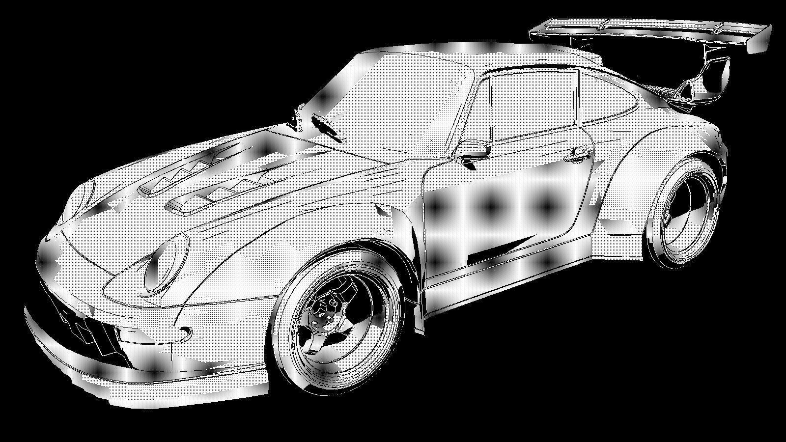
For this example I've used a free model of a Porsche 911 available via the link https://www.thingiverse.com/thing:2946486

    ; porsche 911 race car: https://www.thingiverse.com/thing:2946486
    
    ; load the mesh
    (define id (load-mesh "D:/stl/porsche/complete.stl"))
    
    ; set view properties
    (view-onebit-set! #t)
    (view-size-set! 1920 1024)
    (view-bg-set! 0 0 0)
    (view-shadow-set! #t)
    
    ; set coordinate system for the view
    (define cs '((0.593359 -0.220264 0.774216 11.876) (0.803842 0.212337 -0.555654 -2.86377) (-0.0420054 0.952049 0.303049 5.89276) (0 0 0 1)))
    (view-cs-set! cs)
    
    ; show the view window
    (view-show!)
    
    ; save the view as png image
    (view-export "D:/stl/porsche/porsche.png")

### Gyroid with marching cubes
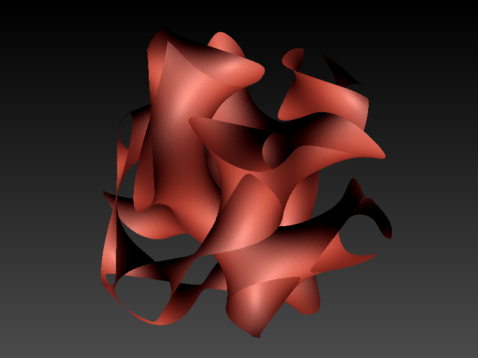

    (define gyroid_a 1)

    (define gyroid 
                (lambda (x y z)
                        (/ (abs
                                (+ (* (sin x) (cos y)) (* (sin y) (cos z)) (* (sin z) (cos x))) )
                           gyroid_a ))) ; implicit function for the gyroid
           
    (define bb '((-3.15 3.15) (-3.15 3.15) (-3.15 3.15))) ; bounding box
    (define dim `(100 100 100)) ; dimensions
    
    (define id (marching-cubes bb dim 1.0 gyroid)) ; making a mesh with marching cubes

    (view-edges-set! #f) ; view properties
    (view-show!) ; show the 3d view
    
### 68 landmarks for Basel face model

The Basel face model is a morphable model containing shape and color information of 200 subjects. The following script will automatically compute the vertex indices corresponding with the 68 facial landmark points as defined by https://ibug.doc.ic.ac.uk/resources/300-W/.

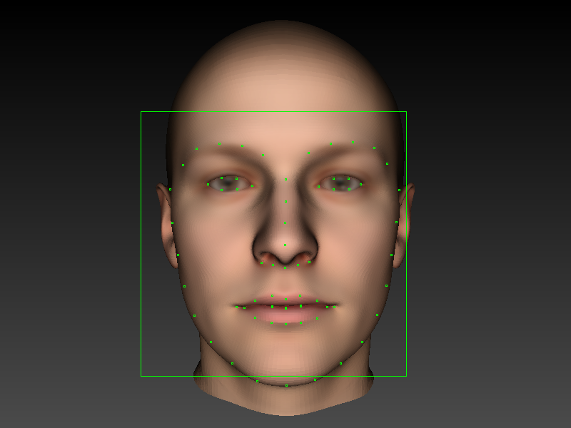

For this script you need to get the Basel face model (2019) from https://faces.dmi.unibas.ch/bfm/bfm2019.html and the dlib 68 facial landmarks predictor from https://github.com/davisking/dlib-models.

    (view-edges-set! #f) ; view render properties
    (view-show!) ; load the 3d view
    
    ; load the basel face model (https://faces.dmi.unibas.ch/bfm/bfm2019.html)
    (define basel (load-morphable-model "D:/basel_face_model/model2019_fullHead.h5"))
    
    ; load the dlib 68 face landmarks predictor (https://github.com/davisking/dlib-models)
    (define sp (load-shape-predictor "D:/neural_networks/shape_predictor_68_face_landmarks.dat"))
    
    ; set the view coordinate system so that the basel face model is aligned nicely
    (view-cs-set! '((1 0 0 0.253426) (0 1 0 16.3451) (0 0 1 520.029) (0 0 0 1)))
    
    ; get the landmarks
    (define landmarks (shape-predict sp (face-detect)))
    
    ; compute the corresponding vertex indices of the landmarks
    (define indices '())
    (let loop ((times 0))
      (if (eq? times (length landmarks))
          indices
          (begin
            (set! indices (append indices (list (view-index (list-ref (list-ref landmarks times) 0) (list-ref (list-ref landmarks times) 1)))))
            (loop (+ times 1))
          )
      )
    )
    
    ; visualize the face detector and predictor
    (view-face-detector-set! #t)
    (shape-predictor-link-to-face-detector sp)
    
    ; show the indices in the repl
    indices

If you're interested in the vertex indices computed automatically, this is the output of the meshscript repl:

    ms> compiling primitives library...
    ms> compiling string-to-symbol...
    ms> compiling apply...
    ms> compiling call/cc library...
    ms> compiling r5rs library...
    ms> compiling modules...
    ms> compiling packages.scm...
    ms> compiling basel_indices.scm...
    (50554 49734 39678 57089 53700 34983 29867 29803 33294 18746 960 5881 24405 20551 10408 27676 14071 48784 56510 47558 41896 51179 21884 12601 18263 27215 26530 38214 38937 38126 37890 46209 42590 33495 27683 16914 44826 43055 55328 44026 31881 52594 14731 26033 24600 11988 7898 19180 31761 31013 30769 38414 9204 23032 28235 14011 2291 33531 41368 54142 45513 38161 58180 12118 1791 26503 33236 38161)

    Welcome to meshscript
    Type ,? for help.
    ms>

### Make funny faces

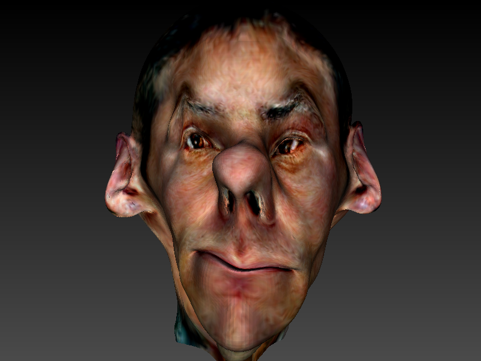

[Video on YouTube](https://www.youtube.com/watch?v=E0i4JgXI2Y4)

For this script you need to get the Basel face model (2019) from https://faces.dmi.unibas.ch/bfm/bfm2019.html.

    (import 'srfi-27) ; random number generation
    
    (define sigma-factor 5) ; set to 1 for normal faces, 5 for funny faces
    
    ; load the basel face model
    (define id (load-morphable-model "D:/_Development/basel_face_model/model2019_fullHead.h5"))
    
    ; get the coefficient vector and color coefficient vector
    (define coeff (list->vector (morphable-model-coefficients id)))
    (define color-coeff (list->vector (morphable-model-color-coefficients id)))
    
    ; set a random value at index i in the coefficient vector
    (define (set-random-coeff i)
      (let ((r (- (* 2 (random-real)) 1)))    
        (let ((c (* (morphable-model-sigma id i) sigma-factor r)))
          (vector-set! coeff i c)
        )
      )
    )
    
    ; set a random value at index i in the color coefficient vector
    (define (set-random-color-coeff i)
      (let ((r (- (* 2 (random-real)) 1)))    
        (let ((c (* (morphable-model-color-sigma id i) sigma-factor r)))
          (vector-set! color-coeff i c)
        )
      )
    )
    
    ; loop over all coefficients and set random values
    (define (random-face)
      (let loop ((times 0))
        (if (eq? times (morphable-model-coefficients-size id))
            #t
            (begin
              (set-random-coeff times)
              (set-random-color-coeff times)
              (loop (+ times 1))
            )
        )
      )
      (morphable-model-coefficients-set! id (vector->list coeff))
      (morphable-model-color-coefficients-set! id (vector->list color-coeff))
    )
    
    (view-edges-set! #f) ; turn of rendering of edges
    (view-show!) ; show the 3d view
    
    ; render 1000 different arbitrary faces
    (let loop ((times 0))
      (if (eq? times 1000)
          #t
          (begin
            (random-face)
            (loop (+ times 1))
          )
      )
    )
    
### Map vertex values to colors    
    
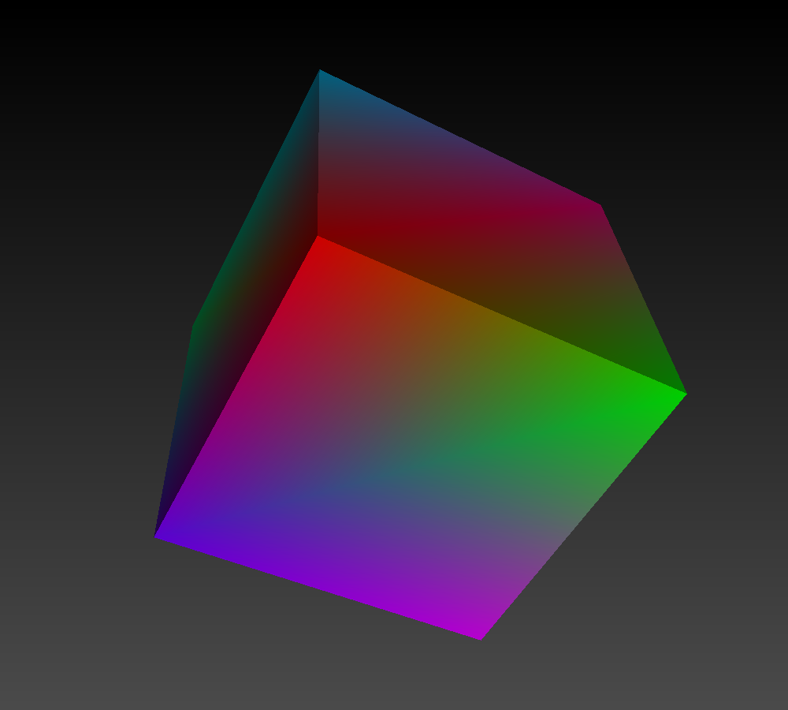

This example uses three csv (comma separated value) files with data. These files have the following content:

`vertices.csv` :

    -1, -1,  1
     1, -1,  1
     1,  1,  1
    -1,  1,  1
    -1, -1, -1
     1, -1, -1
     1,  1, -1
    -1,  1, -1
    
`triangles.csv` :

    0, 1, 2
    0, 2, 3
    7, 6, 5
    7, 5, 4
    1, 0, 4
    1, 4, 5
    2, 1, 5
    2, 5, 6
    3, 2, 6
    3, 6, 7
    0, 3, 7
    0, 7, 4 

`values.csv` :

    100
    -80
    76
    -25
    30
    50
    0
    -60

The following script will load `vertices.csv` as vertex data, `triangles.csv` as triangle indices data, and `values.csv` as values assigned to the corresponding vertex. Next we plot the mesh, and map a color code to the vertex values.

    (import 'csv) ; functionality for reading csv files
    
    (define vertices (csv->numbers (read-csv "D:/colorplot/vertices.csv"))) ; load vertices
    (define triangles (csv->numbers (read-csv "D:/colorplot/triangles.csv"))) ; load triangles
    
    (define id (make-mesh vertices triangles)) ; make a mesh
    
    (define values (csv->numbers (read-csv "D:/colorplot/values.csv"))) ; load values
    
    (set! values (map car values)) ; unmap the list of lists to a simple list of values
    
    (define (max-list xs)
      (if 
        (equal? (cdr xs) '()) 
                (car xs)
                (max (car xs) (max-list (cdr xs)))))
    
    (define (min-list xs)
      (if 
        (equal? (cdr xs) '()) 
                (car xs)
                (min (car xs) (min-list (cdr xs)))))
                
          
    (define minimum (min-list values)) ; compute the minimum value
    (define maximum (max-list values)) ; compute the maximum value
    
    
    (define (rescale x)
      ( / (- x minimum) (- maximum minimum) )
    )      
           
           
    (define rescaled (map rescale values)) ; rescale all values between 0 and 1
                
    (define colors (jet rescaled)) ; map the values to colors
    
    (vertexcolors-set! id colors) ; set the vertex colors
    
    (view-edges-set! #f) ; don't render edges
    (view-size-set! 1000 1000) ; increase the view
    
    (view-show!) ; show the view

### Compare facial scans

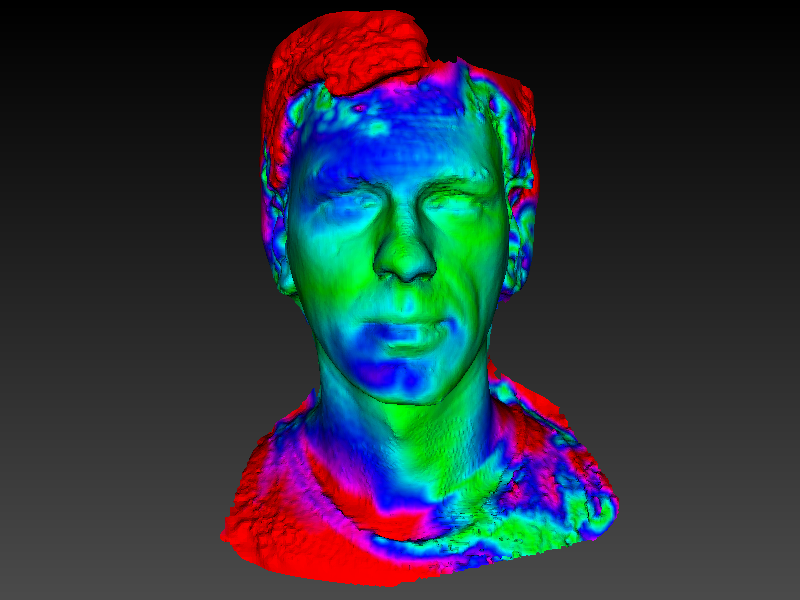

For this script you need to get the dlib 68 facial landmarks predictor from https://github.com/davisking/dlib-models.
Furthermore this example uses two scans of myself taken at a different time. Replace `jan1.obj` and `jan2.obj` by two facial scans with texture that you have at your disposal.
    
    ; load dlib 68 face landmarks shape predictor
    (define sp (load-shape-predictor "D:/neural_networks/shape_predictor_68_face_landmarks.dat"))
    
    (define id1 (load-mesh "D:/scans/jan1.obj")) ; the first scan
    (define id2 (load-mesh "D:/scans/jan2.obj")) ; the second scan
    
    (cs-rotate! id1 -90 0 0) ; rotate the first scan so that the front faces the camera
    (cs-rotate! id2 -90 0 0) ; rotate the second scan so that the front faces the camera
    
    (hide! id1) ; don't render the first scan
    (hide! id2) ; don't render the second scan
    
    (view-show!) ; open the 3d view
    
    ; zoom out a bit to have the full scan visible
    (view-cs-set! '((1 0 0 2.841) (0 1 0 49.722) (0 0 1 770.457) (0 0 0 1)))
    
    (view-edges-set! #f); don't render edges
    
    (show! id1) ; render the first scan
    
    ; compute the 68 facial landmarks for the first scan
    (define landmarks1 (shape-predict sp (face-detect)))
    
    ; compute the corresponding 3d positions of the 68 facial landmarks for the first scan
    (define positions1 '())
    (let loop ((times 0))
      (if (eq? times (length landmarks1))
          positions1
          (begin
            (set! positions1 (append positions1 (list (view-position (list-ref (list-ref landmarks1 times) 0) (list-ref (list-ref landmarks1 times) 1)))))
            (loop (+ times 1))
          )
      )
    )
    
    (hide! id1) ; hide the first scan
    (show! id2) ; render the second scan
    
    ; compute the 68 facial landmarks for the second scan
    (define landmarks2 (shape-predict sp (face-detect)))
    
    ; compute the corresponding 3d positions of the 68 facial landmarks for the second scan
    (define positions2 '())
    (let loop ((times 0))
      (if (eq? times (length landmarks2))
          positions2
          (begin
            (set! positions2 (append positions2 (list (view-position (list-ref (list-ref landmarks2 times) 0) (list-ref (list-ref landmarks2 times) 1)))))
            (loop (+ times 1))
          )
      )
    )
    
    ; n-point registration of the 68 landmark points of the two scans
    (define transformation_npoint (npoint positions1 positions2))
    (cs-premultiply! id1 transformation_npoint)
    
    ; iterative closest point between the two scans
    (define transformation_icp (icp id1 id2 5))
    (cs-premultiply! id1 transformation_icp)
    
    (show! id1) ; render the first scan
    (hide! id2) ; hide the second scan
    
    (define dm (distance-map id1 id2 #f)) ; compute the distance map between the two scans     
    
    (define (clamp x minimum maximum) ; clamps a value x to the interval [minimum;maximum]
      (if (< x minimum)
         minimum
         (if (> x maximum)
             maximum
             x
         )))
         
    (define maximum-distance 10) ; 10 mm
    
    (define (rescale x)
      ( / (clamp x 0 maximum-distance) maximum-distance )
    )      
    
    (define rescaled (map rescale dm)) ; rescale all values of the distance map to [0;1]            
    (define colors (jet rescaled)) ; map the values to colors
    
    (vertexcolors-set! id1 colors) ; set the vertex colors on the first scan
    
### Convert Obj to Ply

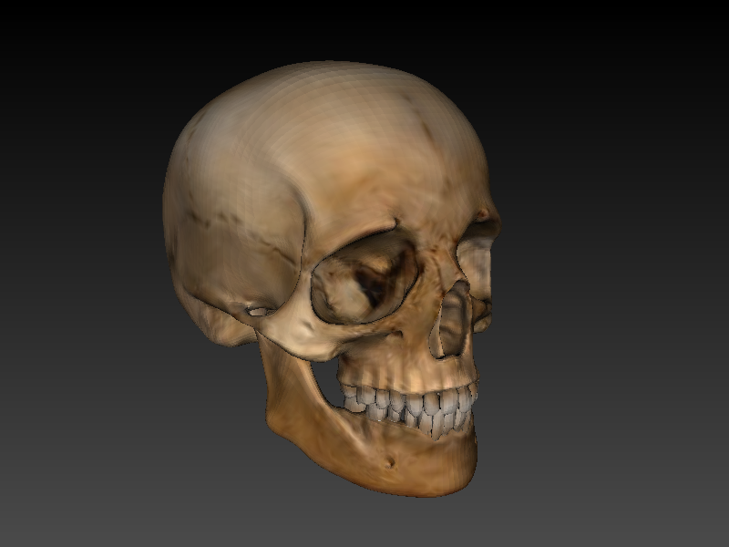

For this example I've downloaded an obj file with texture from https://free3d.com/nl/3d-model/skull-v3--785914.html.

    (define id (load-mesh "D:/stl/obj/skull/12140_Skull_v3_L2.obj")) ; load an obj with texture
    
    (view-show!) ; show the 3d view
    
    (view-edges-set! #f) ; don't render the edges
    
    (define vertexclrs (mesh-texture->vertexcolors id)) ; get the colors per vertex from the texture
    
    (vertexcolors-set! id vertexclrs) ; set vertexcolors for this mesh
    
    (save id "D:/stl/obj/skull/skull.ply") ; save as ply with vertex colors
    
### Pointcloud to mesh with Poisson surface reconstruction

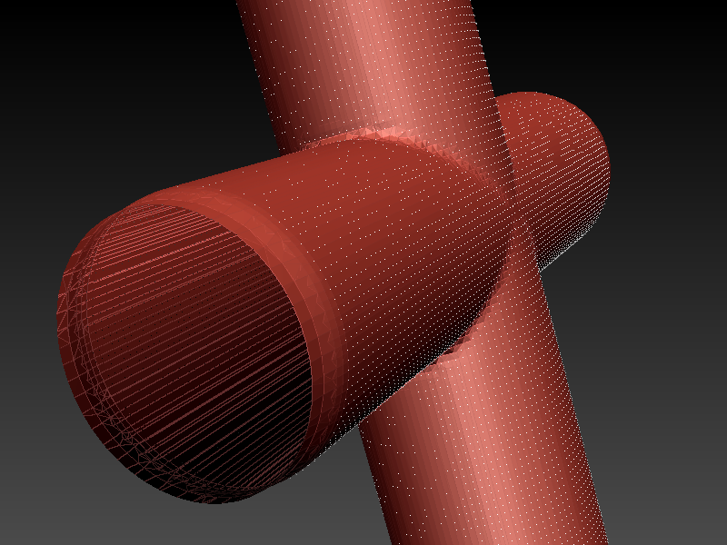

    
    (define xsteps 100)
    (define ysteps 100)
    (define pi 3.1415926535)
    
    (define rad 15)
    
    (define (cylinder1 x y) ; parametric representation of the first cylinder
      (list (* rad (sin x)) (* rad (cos x)) (- y (/ ysteps 2)))
    )
    
    (define (cylinder2 x y) ; parametric representation of the second cylinder
      (list (* rad (sin x)) (- y (/ ysteps 2)) (* rad (cos x)))
    )
    
    (define (inside-cylinder1 pos) ; returns #t if pos is inside the first cylinder
      (let ((x (list-ref pos 0)) (y (list-ref pos 1)) (z (list-ref pos 2)))
        (let ((r (+ (* x x) (* y y))))
          (if (< r (* rad rad))
              #t
              #f
          )
        )
      )
    )
    
    (define (inside-cylinder2 pos) ; returns #t if pos is inside the second cylinder
      (let ((x (list-ref pos 0)) (y (list-ref pos 1)) (z (list-ref pos 2)))
        (let ((r (+ (* x x) (* z z))))
          (if (< r (* rad rad))
              #t
              #f
          )
        )
      )
    )
    
    (define vertices '())
    
    (let loop1 ((x 0)) ; loop over the first parameter
      (if (eq? x xsteps)
          vertices
          (begin
            (let loop2 ((y 0)) ; loop over the second parameter
              (if (eq? y ysteps)
                  vertices
                  (begin
                    (let* ((a (/ (* x 2.0 pi) xsteps)) (pos1 (cylinder1 a y)) (pos2 (cylinder2 a y)))
                      (if (not (inside-cylinder2 pos1))  
                        (set! vertices (append vertices (list pos1)))
                      )
                      (if (not (inside-cylinder1 pos2))  
                        (set! vertices (append vertices (list pos2)))
                      )
                    )
                    (loop2 (+ y 1))      
                  )))      
            (loop1 (+ x 1))
          )))
    
    (define id (make-pointcloud vertices)) ; make a pointcloud from the vertices
    
    (pointcloud-normals-estimate! id 10) ; estimate normals for the pointcloud
    
    (define id2 (poisson id 5)) ; poisson surface reconstruction
    
    (view-show!) ; show the 3d view
    
### Parametric representation of Klein's bottle

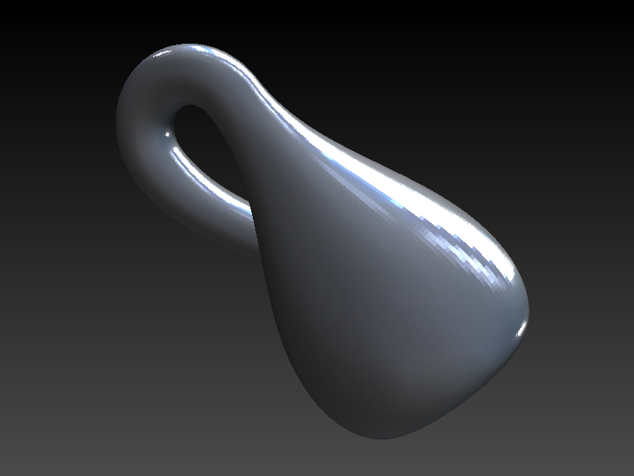    
    
    (define pi 3.1415926535897)
    
    (define (KleinX u v)
      (if (< v pi)         
          (* (- 2.5 (* 1.5 (cos v))) (cos u))
          (if (< v (* 2.0 pi)) 
              (* (- 2.5 (* 1.5 (cos v))) (cos u))
              (if (< v (* 3.0 pi)) 
                  (- (* (+ 2.0 (cos u)) (cos v)) 2.0)
                  (- (* 2.0 (cos v)) 2.0 (cos u))
              ))))
    
    (define (KleinY u v)
      (if (< v pi)         
          (* (- 2.5 (* 1.5 (cos v))) (sin u))
      
          (if (< v (* 2.0 pi)) 
              (* (- 2.5 (* 1.5 (cos v))) (sin u))
              (if (< v (* 3.0 pi)) 
                  (sin u)
                  (sin u)
              ))))
    
    (define (KleinZ u v)
      (if (< v pi)         
          (* -2.5 (sin v))
          (if (< v (* 2.0 pi)) 
              (- (* 3.0 v)(* 3.0 pi))
              (if (< v (* 3.0 pi)) 
                  (+ (* (+ 2.0 (cos u))(sin v)) (* 3.0 pi))
                  (- (* 12.0 pi) (* 3.0 v))
              ))))
    
    (define (KleinBottle u v) ; parametric representation of the Klein bottle
      (list (KleinX u v) (KleinY u v) (KleinZ u v))
    )
    
    ; the domain as a list: min_u, max_u, step_u, min_v, max_v, step_v
    (define domain (list 0.0 (* 2.0 pi) (/ pi 72.0) 0.0 (* 4.0 pi) (/ pi 72.0)))
    
    ; generate a mesh from the parametric representation
    (define id (parametric KleinBottle domain))
    
    ; set a matcap for nice rendering
    (define matcap (load-image "D:/my_matcaps/ceramic_lightbulb.png"))
    (matcap-set! id matcap)
    
    (view-textured-set! #f) ; don't render the uv domain / texture
    (view-edges-set! #f) ; don't render edges
    
    (view-show!) ; show the 3d view    
 
### Compressing STL files by a factor 5

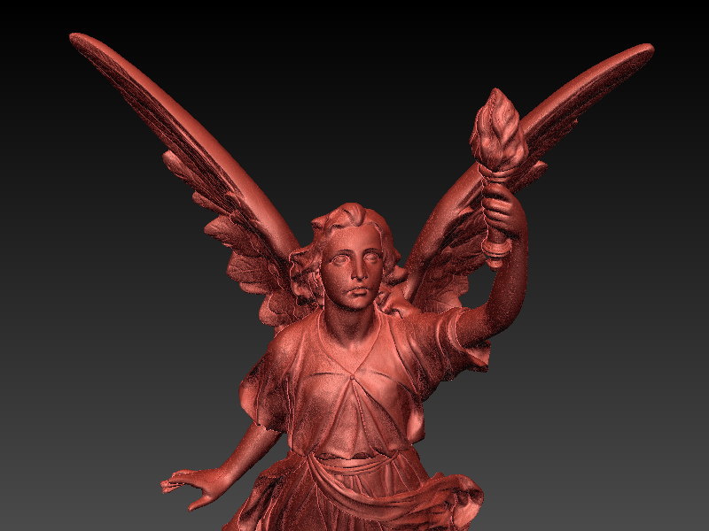    

Load any file, and save it to TRC file format, see [trico](https://github.com/janm31415/trico/).

    (define id (load-mesh "D:/stl/lucy.stl"))
    (save id "D:/compressed_files/lucy.trc"))

The following table comes from trico, and shows the compression ratios of the TRC file format. Note that TRC is much faster in compression and decompression than the standard zip algorithm (zdeflate / zinflate). TRC is lossless. The files were taken from the [Stanford 3D Scanning Repository](http://graphics.stanford.edu/data/3Dscanrep/). 

Model | Triangles | Vertices | Binary STL | Binary PLY | Binary PLY zipped | Trico | Compression ratio vs STL | Compression ratio vs PLY | Compression ratio vs PLY zipped
----- | --------- | -------- | ---------- | ---------- | ----------------- | ----- | ------------------------ | ------------------------ | -------------------------------
Stanford Bunny | 69451 | 35947 | 3392 KB | 1291 KB | 522 KB | 571 KB | 5.94 | 2.26 | 0.91
Happy Buddha | 1087716 | 543652 | 53112 KB | 20180 KB | 10135 KB | 9146 KB | 5.81 | 2.21 | 1.11
Dragon | 871414 | 437645 | 42550 KB | 16192 KB | 8129 KB | 7274 KB | 5.85 | 2.23 | 1.12
Armadillo | 345944 | 172974 | 16892 KB | 6757 KB | 3794 KB | 4059 KB | 4.16 | 1.66 | 0.93
Lucy | 28055742 | 14027872 | 1369910 KB | 520566 KB | 296014 kB | 230609 KB | 5.94 | 2.26 | 1.28
Asian Dragon | 7219045 | 3609600 | 352493 KB | 133949 KB | 68541 KB | 49896 KB | 7.06 | 2.68 | 1.37
Vellum manuscript* | 4305818 | 2155617 | 210246 KB | 86241 KB | 42783 KB | 23465 KB | 8.96 | 3.68 | 1.82
Thai Statue | 10000000 | 4999996 | 488282 KB | 185548 KB | 104048 KB | 86165 KB | 5.67 | 2.15 | 1.21

\* the PLY and Trico file contain vertex colors, the STL file does not.

### CSG modelling

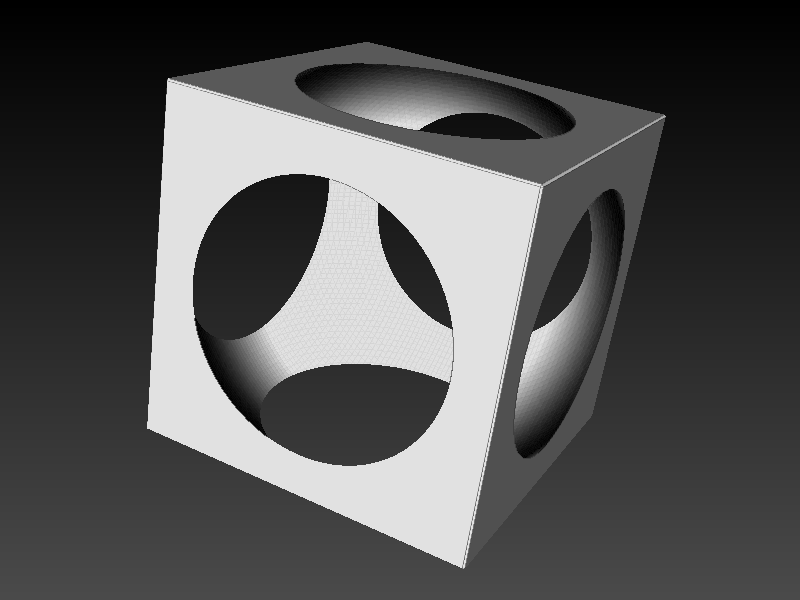    

    (define length-square
      (lambda (x y z)
        (+ (* x x) (* y y) (* z z))
      ))
    
    (define sphere-radius-square 1)
    
    (define sphere ; signed distance function for a sphere
      (lambda (x y z)
              (- (length-square x y z) sphere-radius-square)))
                 
       
    (define cube-radius 0.8)
     
    (define cube ; signed distance function for a cube
      (lambda (x y z)
         (let ((xx (- (abs x) cube-radius)) (yy (- (abs y) cube-radius)) (zz (- (abs z) cube-radius)))
           (+ (sqrt (length-square (max xx 0.0) (max yy 0.0) (max zz 0.0))) (min (max xx yy zz) 0.0))
         )))
           
                               
    (define bb '((-1.2 1.2) (-1.2 1.2) (-1.2 1.2))) ; the bounding box for marching cubes         
    (define dim `(100 100 100)) ; the dimensions for marching cubes
    
    (define sph (marching-cubes bb dim 0.0 sphere)) ; make a sphere with marching cubes
    
    (define cub (marching-cubes bb dim 0.0 cube)) ; make a cube with marching cubes
    
    (define res (difference cub sph)) ; compute the difference of the cube and the sphere
    (matcap-set! res 3) ; choose matcap nr 3 for rendering
    
    (hide! sph) ; hide the sphere
    (hide! cub) ; hide the cube
    
    (view-show!)

Glossary
--------

Below follows a dump of all the meshscript methods so far. 

    NAME
    	cs
    DESCRIPTION
    	(cs id) returns the coordinate system for the object
    	with tag `id`.
    
    NAME
    	cs-apply!
    DESCRIPTION
    	(cs-apply! id) transforms the vertices of object with
    	tag `id` by its coordinate system, and sets its coordinate
    	system to the world.
    
    NAME
    	cs-rotate!
    DESCRIPTION
    	(cs-rotate! id x y z) rotates the object with tag `id`
    	by `x` degrees over the x-axis, by `y` degrees over
    	the y-axis, and by `z` degrees over the z-axis.
    
    NAME
    	cs-set!
    DESCRIPTION
    	(cs-set! id cs) sets a new coordinate system for the
    	object with tag `id`. The coordinate system `cs` can
    	be given as a vector of size 16 in column major format
    	or as a list of lists in row major format.
    
    NAME
    	cs-translate!
    DESCRIPTION
    	(cs-translate! id x y z) translates the object with
    	tag `id` by vector (x y z).
    
    NAME
    	cs-premultiply!
    DESCRIPTION
    	(cs-premultiply! id cs) premultiplies the coordinate
    	system of the object with tag `id` by the input coordinate
    	system. The coordinate system `cs` can be given as
    	a vector of size 16 in column major format or as a
    	list of lists in row major format.
    
    NAME
    	difference
    DESCRIPTION
    	(difference id1 id2) computes the difference of the
    	meshes or morphable models with tag `id1` and tag `id2`
    	and returns the id of the result.
    
    NAME
    	distance-map
    DESCRIPTION
    	(distance-map id1 id2 bool-signed) returns a list with
    	values that represent the distance between objects
    	with tag `id1` and `id2`. For each vertex of object
    	`id1` there is exactly one distance in the list. The
    	distance can be signed or unsigned, depending on the
    	boolean value that is given to `bool-signed`.
    
    NAME
    	duplicate
    DESCRIPTION
    	(duplicate id) makes a duplicate of the object with
    	tag `id`.
    
    NAME
    	ear-right-detect
    DESCRIPTION
    	(ear-right-detect) runs the ear detector on the current
    	view and returns a list of lists of the form ((x y
    	w h) ...) where (x y w h) represents a rectangle containing
    	the right ear starting in corner (x,y) and with sizes
    	(w,h).
    
    NAME
    	ear-left-detect
    DESCRIPTION
    	(ear-left-detect) runs the ear detector on the current
    	view and returns a list of lists of the form ((x y
    	w h) ...) where (x y w h) represents a rectangle containing
    	the left ear starting in corner (x,y) and with sizes
    	(w,h).
    
    NAME
    	face-detect
    DESCRIPTION
    	(face-detect) runs the face detector on the current
    	view and returns a list of lists of the form ((x y
    	w h) ...) where (x y w h) represents a rectangle containing
    	the face starting in corner (x,y) and with sizes (w,h).
    
    NAME
    	force-redraw
    DESCRIPTION
    	(force-redraw) redraws the canvas. This is useful if
    	you want to use view-position in your script, as view-position
    	uses the data of the last render of the view.
    
    NAME
    	hide!
    DESCRIPTION
    	(hide! id) makes the object with tag `id` invisible.
    
    NAME
    	icp
    DESCRIPTION
    	(icp id1 id2 inlier-distance) returns the result of
    	the iterative closest point algorithm between objects
    	with tag `id1` and `id2`. This result is always a 4x4
    	transformation matrix. The iterative closest point
    	algorithm will only use correspondences between `id1`
    	and `id2` if their distance is smaller than `inlier-distance`.
    
    NAME
    	info
    DESCRIPTION
    	(info id) prints info on the object with tag `id`.
    
    NAME
    	intersection
    DESCRIPTION
    	(intersection id1 id2) computes the intersection of
    	the meshes or morphable models with tag `id1` and tag
    	`id2` and returns the id of the result.
    
    NAME
    	jet
    DESCRIPTION
    	(jet lst) takes a list `lst` of values between 0 and
    	1 and returns a list of lists with (r g b) values.
    
    NAME
    	load-mesh
    DESCRIPTION
    	(load-mesh "stlfile.stl") loads the STL file and returns
    	an id. Similarly (load-mesh "objfile.obj") loads an
    	OBJ file and returns the id. Other input mesh formats
    	that are implemented are PLY, OFF, and TRC.
    
    NAME
    	load-morphable-model
    DESCRIPTION
    	(load-morphable-model "model2019_fullHead.h5") loads
    	morphable models following the hdf5 file format as
    	used by the Basel Face Model project (https://faces.dmi.unibas.ch/bfm/bfm2019.html).
    	The other file format that can be read is meshscripts
    	own binary morphable model file format with extension
    	SSM.
    
    NAME
    	load-pointcloud
    DESCRIPTION
    	(load-pointcloud "pointcloud.ply") loads the PLY file
    	as point cloud and returns an id. Other file formats
    	allowed are OBJ, TRC, PTS, or XYZ.
    
    NAME
    	load-shape-predictor
    DESCRIPTION
    	(load-shape-predictor "filename") initializes the shape
    	predictor with the data given by "filename" and returns
    	the id. This is the dlib shape predictor (http://dlib.net).
    	The 68 points facial landmarks predictor data can be
    	downloaded from https://github.com/davisking/dlib-models
    
    NAME
    	load-image
    DESCRIPTION
    	(load-image "image.png") loads the PNG file as image
    	and returns an id. Other well known image formats can
    	also be loaded.
    
    NAME
    	make-mesh
    DESCRIPTION
    	(make-mesh vertices triangles) creates the mesh with
    	given `vertices` and `triangles`, and returns the id
    	of the created object. `vertices` should be a list
    	of lists of the form ((x y z) (x y z) ...) with x,y,z
    	floating point values, and `triangles` should be a
    	list of lists of the form ((a b c) (d e f) ...) with
    	a,b... fixnums referring to the vertex indices.
    
    NAME
    	make-pointcloud
    DESCRIPTION
    	(make-pointcloud vertices) creates the pointcloud with
    	given `vertices`, and returns the id of the created
    	object. `vertices` should be a list of lists of the
    	form ((x y z) (x y z) ...) with x,y,z floating point
    	values.
    
    NAME
    	marching-cubes
    DESCRIPTION
    	(marching-cubes bb dim isovalue fun) with `bb` representing
    	the bounding box of the form ((min_x max_x) (min_y
    	max_y) (min_z max_z)), `dim` representing the dimensions
    	of the form (width height depth), `isovalue` a flonum
    	representing the signed distance requested, and `fun`
    	representing the distance functions as a lambda function
    	accepting (x y z) values and returning a distance.
    
    NAME
    	matcap-set!
    DESCRIPTION
    	(matcap-set! id matcap-id) changes the matcap of the
    	object with tag `id`. The matcap is given by its id
    	`matcap-id`. There are 4 hard-coded matcaps with ids
    	0, 1, 2, 3. You can also provide an image id as `matcap-id`,
    	see load-image.
    
    NAME
    	mesh->pointcloud
    DESCRIPTION
    	(mesh->pointcloud id) converts the mesh with tag `id`
    	to a pointcloud.
    
    NAME
    	mesh-texture->image
    DESCRIPTION
    	(mesh-texture->image id) converts the texture of the
    	mesh with tag `id` to an image.
    
    NAME
    	mesh-texture->vertexcolors
    DESCRIPTION
    	(mesh-texture->vertexcolors id) will return a list of
    	lists of the form ((r g b) (r g b) ... ). Each vertex
    	of the object with tag `id` has a corresponding (r
    	g b) value. This (r g b) value is obtained from the
    	texture of `id`, if available.
    
    NAME
    	mesh-texture-set!
    DESCRIPTION
    	(mesh-texture-set! id tex) sets the image with tag `tex`
    	as texture for the mesh with tag `id`,
    
    NAME
    	morphable-model-coefficients-size
    DESCRIPTION
    	(morphable-model-coefficients-size mm_id) returns the
    	number of coefficients for the morphable model with
    	tag `mm_id`.
    
    NAME
    	morphable-model-shape-size
    DESCRIPTION
    	(morphable-model-shape_size mm_id) returns the shape
    	size for the morphable model with tag `mm_id`. This
    	is equal to the number of rows in the U matrix, where
    	a shape S is represented as S = mu + U*c, with mu the
    	average shape, and c the coefficients vector.
    
    NAME
    	morphable-model-sigma
    DESCRIPTION
    	(morphable-model-sigma mm_id idx) returns sigma for
    	the morphable model with tag `mm_id` at coefficient
    	index `idx`.
    
    NAME
    	morphable-model-coefficients
    DESCRIPTION
    	(morphable-model-coefficients mm_id) returns the list
    	of coefficients for the morphable model with tag `mm_id`.
    
    NAME
    	morphable-model-basic-shape-coefficients
    DESCRIPTION
    	(morphable-model-basic-shape-coefficients mm_id idx)
    	returns the list of coefficients of the `idx`-th shape
    	that was used to generate this morphable model. Not
    	all morphable models have this data. For instance the
    	Basel shape model does not contain this data.
    
    NAME
    	morphable-model-coefficients-set!
    DESCRIPTION
    	(morphable-model-coefficients-set! mm_id coeff) sets
    	the list of coefficients for the morphable model with
    	tag `mm_id`. Here `coeff` is a list of coefficient
    	values, and its size should equal (morphable-model-coefficients-size
    	mm_id).
    
    NAME
    	morphable-model->mesh
    DESCRIPTION
    	(morphable-model->mesh mm_id) converts the morphable
    	model with tag `mm_id` to a mesh and returns the new
    	id.
    
    NAME
    	morphable-model-color-coefficients-size
    DESCRIPTION
    	(morphable-model-color-coefficients-size mm_id) returns
    	the number of color coefficients for the morphable
    	model with tag `mm_id`.
    
    NAME
    	morphable-model-color-shape-size
    DESCRIPTION
    	(morphable-model-color-shape_size mm_id) returns the
    	shape size for the color part of the morphable model
    	with tag `mm_id`. This is equal to the number of rows
    	in the U_color matrix, where a the shape colors S_color
    	are represented as S_color = mu_color + U_color*c,
    	with mu_color the average shape colors, and c the color
    	coefficients vector.
    
    NAME
    	morphable-model-color-sigma
    DESCRIPTION
    	(morphable-model-color-sigma mm_id idx) returns sigma
    	for the colors of the morphable model with tag `mm_id`
    	at color coefficient index `idx`.
    
    NAME
    	morphable-model-color-coefficients
    DESCRIPTION
    	(morphable-model-color-coefficients mm_id) returns the
    	list of color coefficients for the morphable model
    	with tag `mm_id`.
    
    NAME
    	morphable-model-color-basic-shape-coefficients
    DESCRIPTION
    	(morphable-model-color-basic-shape-coefficients mm_id
    	idx) returns the list of color coefficients of the
    	`idx`-th color shape that was used to generate this
    	morphable model. Not all morphable models have this
    	data. For instance the Basel shape model does not contain
    	this data.
    
    NAME
    	morphable-model-color-coefficients-set!
    DESCRIPTION
    	(morphable-model-color-coefficients-set! mm_id coeff)
    	sets the list of color coefficients for the morphable
    	model with tag `mm_id`. Here `coeff` is a list of color
    	coefficient values, and its size should equal (morphable-model-color-coefficients-size
    	mm_id).
    
    NAME
    	morphable-model-fit-indices!
    DESCRIPTION
    	(morphable-model-fit-indices! mm_id indices positions)
    
    NAME
    	morphable-model-fit!
    DESCRIPTION
    	(morphable-model-fit! mm_id mesh_id)
    
    NAME
    	npoint
    DESCRIPTION
    	(npoint from to) computes the npoint-registration of
    	the set of 3d points in `from` to the set of 3d points
    	in `to`. The result is a 4x4 transformation matrix.
    	Here `from` and `to` are lists of lists of the form
    	((x y z) (x y z) ...) and `from` and `to` should have
    	the same amount of 3d points.
    
    NAME
    	parametric
    DESCRIPTION
    	(parametric fun domain) returns the id of a new mesh.
    	The mesh is created from a lambda function `fun`, where
    	`fun` accepts two floating input values (u v) and returns
    	a list (x y z). The input variable `domain` is a list
    	of the form (min_u max_u step_u min_v max_v step_v)
    	describing the uv parameter domain.
    
    NAME
    	pointcloud-normals-estimate!
    DESCRIPTION
    	(pointcloud-normals-estimate! id k) creates vertex normals
    	for the pointcloud with tag `id` by taking the `k`
    	nearest neighbours of each vertex, fit a least squares
    	plane through these points, and use the normal of this
    	plane as estimate.
    
    NAME
    	poisson
    DESCRIPTION
    	(poisson pc_id depth) applies Poisson surface reconstruction
    	to the pointcloud with tag `pc_id`. This is the screened
    	Poisson surface reconstruction algorithm by M. Kazhdan
    	and H. Hoppe. You have to provide the parameter `depth`
    	which represents the depth of the octree during Poisson
    	surface reconstruction.
    
    NAME
    	save
    DESCRIPTION
    	(save id "file.ext") writes the object with tag `id`
    	to file. The filetype is determined by the extension
    	that is given. You can export meshes to STL, PLY, OBJ,
    	OFF, or TRC, pointclouds to PLY, OBJ, PTS, XYZ, or
    	TRC, morphable models to SSM.
    
    NAME
    	shape-predict
    DESCRIPTION
    	(shape-predict sp_id (x y w h)) or (shape-predict sp_id
    	((x y w h) ...)) runs the shape predictor with tag
    	`sp_id` on the region defined by (x y w h) or on the
    	regions defined by ((x y w h) ...) in the current view
    	and returns the coordinates of the landmarks as a list
    	of lists. The predictor should be initialized with
    	load-shape-predictor.
    
    NAME
    	shape-predictor-horizontal-flip-set!
    DESCRIPTION
    	(shape-predictor-horizontal-flip-set! id #t/#f) toggles
    	horizontal flipping of the shape predictor given by
    	tag `id`.
    
    NAME
    	shape-predictor-link-to-ear-left-detector
    DESCRIPTION
    	(shape-predictor-link-to-ear-left-detector id) links
    	the shape predictor given by tag `id` to the ear left
    	detector. The result of this operation is that the
    	shape predictor is rendered automatically when the
    	left ear detector's automatic rendering is on. You
    	can turn on/off automatic rendering of the left ear
    	detector with the command (view-ear-left-detector-set!
    	#t/#f).
    
    NAME
    	shape-predictor-link-to-ear-right-detector
    DESCRIPTION
    	(shape-predictor-link-to-ear-right-detector id) links
    	the shape predictor given by tag `id` to the ear right
    	detector. The result of this operation is that the
    	shape predictor is rendered automatically when the
    	right ear detector's automatic rendering is on. You
    	can turn on/off automatic rendering of the right ear
    	detector with the command (view-ear-right-detector-set!
    	#t/#f).
    
    NAME
    	shape-predictor-link-to-face-detector
    DESCRIPTION
    	(shape-predictor-link-to-face-detector id) links the
    	shape predictor given by tag `id` to the face detector.
    	The result of this operation is that the shape predictor
    	is rendered automatically when the face detector's
    	automatic rendering is on. You can turn on/off automatic
    	rendering of the face detector with the command (view-face-detector-set!
    	#t/#f).
    
    NAME
    	shape-predictor-unlink
    DESCRIPTION
    	(shape-predictor-unlink id) unlinks the shape predictor
    	given by tag `id`, see shape-predictor-link-to-face-detector,
    	shape-predictor-link-to-ear-right-detector, or shape-predictor-link-to-ear-left-detector.
    
    NAME
    	show!
    DESCRIPTION
    	(show! id) makes the object with tag `id` visible.
    
    NAME
    	trianglenormals
    DESCRIPTION
    	(trianglenormals id) returns the triangle normals of
    	object with tag `id`. The triangle normals are given
    	as a list of lists with (x y z) values.
    
    NAME
    	triangles
    DESCRIPTION
    	(triangles id) returns the triangles of object with
    	tag `id` as a list of lists of the form ((v0 v1 v2)
    	(v3 v4 v4) ...) where each sublist (v0 v1 v2) contain
    	the indices of the vertices that form a triangle. The
    	actual vertex positions can be obtained with the command
    	(vertices id).
    
    NAME
    	triangles->csv
    DESCRIPTION
    	(triangles->csv id "file.csv") exports the triangles
    	of the object with tag `id` to a csv file.
    
    NAME
    	vertexcolors
    DESCRIPTION
    	(vertexcolors id) returns the vertex colors of object
    	with tag `id`. The vertex colors are given as a list
    	of lists with (r g b) values.
    
    NAME
    	vertexnormals
    DESCRIPTION
    	(vertexnormals id) returns the vertex normals of object
    	with tag `id`. The vertex normals are given as a list
    	of lists with (x y z) values.
    
    NAME
    	vertexcolors-set!
    DESCRIPTION
    	(vertexcolors-set! id clrlst) sets vertex colors for
    	the object with tag `id`. The vertex colors are given
    	as a list of lists with (r g b) values.
    
    NAME
    	vertices
    DESCRIPTION
    	(vertices id) returns the vertices of object with tag
    	`id` as a list of lists of the form ((x y z) (x y z)
    	...) where each sublist (x y z) is a 3d point representing
    	the position of that vertex.
    
    NAME
    	union
    DESCRIPTION
    	(union id1 id2) computes the union of the meshes or
    	morphable models with tag `id1` and tag `id2` and returns
    	the id of the result.
    
    NAME
    	vertices->csv
    DESCRIPTION
    	(vertices->csv id "file.csv") exports the vertices of
    	the object with tag `id` to a csv file.
    
    NAME
    	view-bg-set!
    DESCRIPTION
    	(view-bg-set! r g b) changes the background color to
    	(r g b).
    
    NAME
    	view-cs
    DESCRIPTION
    	(view-cs) returns the coordinate system of the view
    	camera.
    
    NAME
    	view-cs-set!
    DESCRIPTION
    	(view-cs-set! cs) sets the coordinate system of the
    	view camera. The coordinate system `cs` can be given
    	as a vector of size 16 in column major format or as
    	a list of lists in row major format.
    
    NAME
    	view-edges-set!
    DESCRIPTION
    	(view-edges-set! #t/#f) turns on/off rendering of edges.
    
    NAME
    	view-export
    DESCRIPTION
    	(view-export "image-file.png") exports the current view
    	to a png image.
    
    NAME
    	view-ear-left-detector-set!
    DESCRIPTION
    	(view-ear-left-detector-set! #t/#f) turns on/off rendering
    	of the left ear detector result.
    
    NAME
    	view-ear-right-detector-set!
    DESCRIPTION
    	(view-ear-right-detector-set! #t/#f) turns on/off rendering
    	of the right ear detector result.
    
    NAME
    	view-face-detector-set!
    DESCRIPTION
    	(view-face-detector-set! #t/#f) turns on/off rendering
    	of the face detector result.
    
    NAME
    	view-hide!
    DESCRIPTION
    	(view-hide!) hides the 3d view.
    
    NAME
    	view-onebit-set!
    DESCRIPTION
    	(view-onebit-set! #t/#f) turns on/off one-bit rendering.
    
    NAME
    	view-position
    DESCRIPTION
    	(view-position x y) returns the 3d position of the vertex
    	in the last render of the 3d view at coordinate (x,y).
    
    NAME
    	view-index
    DESCRIPTION
    	(view-index x y) returns the vertex index of the vertex
    	in the last render of the 3d view at coordinate (x,y).
    
    NAME
    	view-id
    DESCRIPTION
    	(view-id x y) returns the id of the object in the last
    	render of the 3d view at coordinate (x,y).
    
    NAME
    	view-shading-set!
    DESCRIPTION
    	(view-shading-set! #t/#f) turns on/off lighting.
    
    NAME
    	view-shadow-set!
    DESCRIPTION
    	(view-shadow-set! #t/#f) turns on/off rendering of shadow.
    
    NAME
    	view-show!
    DESCRIPTION
    	(view-show!) shows the 3d view.
    
    NAME
    	view-size-set!
    DESCRIPTION
    	(view-size-set! w h) resizes the plotted image to size
    	(w, h).
    
    NAME
    	view-textured-set!
    DESCRIPTION
    	(view-textured-set! #t/#f) turns on/off rendering of
    	texture.
    
    NAME
    	view-unzoom!
    DESCRIPTION
    	(view-unzoom!) sets the camera to its initial position.
    
    NAME
    	view-vertexcolors-set!
    DESCRIPTION
    	(view-vertexcolors-set! #t/#f) turns on/off rendering
    	of vertex colors.
    
    NAME
    	view-wireframe-set!
    DESCRIPTION
    	(view-wireframe-set! #t/#f) turns on/off rendering of
    	wireframe.
    
    NAME
    	exit
    DESCRIPTION
    	(exit) can be used in the input script to end meshscript,
    	so the REPL is skipped.
    
    
    
Credits
--------
- Constructive solid geometry: https://github.com/gilbo/cork
- Delaunay triangulation: https://www.cs.cmu.edu/~quake/triangle.html
- Image file formats: https://github.com/nothings/stb
- Iterative closest point: http://www.cvlibs.net/software/libicp/
- Marching cubes: http://paulbourke.net/geometry/polygonise/
- Morphable models: https://faces.dmi.unibas.ch/bfm/bfm2019.html
- Ply file import/export: http://w3.impa.br/~diego/software/rply/
- Poisson surface reconstruction: https://github.com/mkazhdan/PoissonRecon
- Shape detection and prediction: http://dlib.net/
- Software rendering (qbvh): https://www.embree.org/
